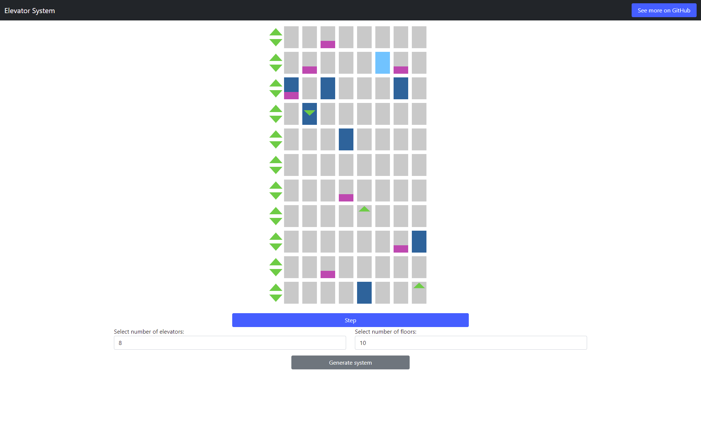
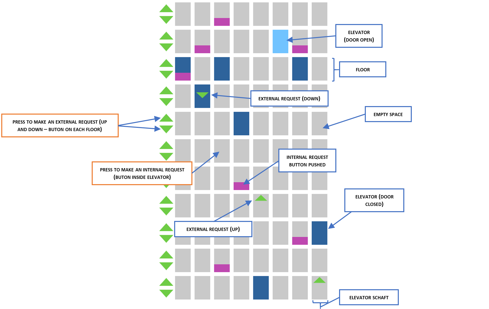
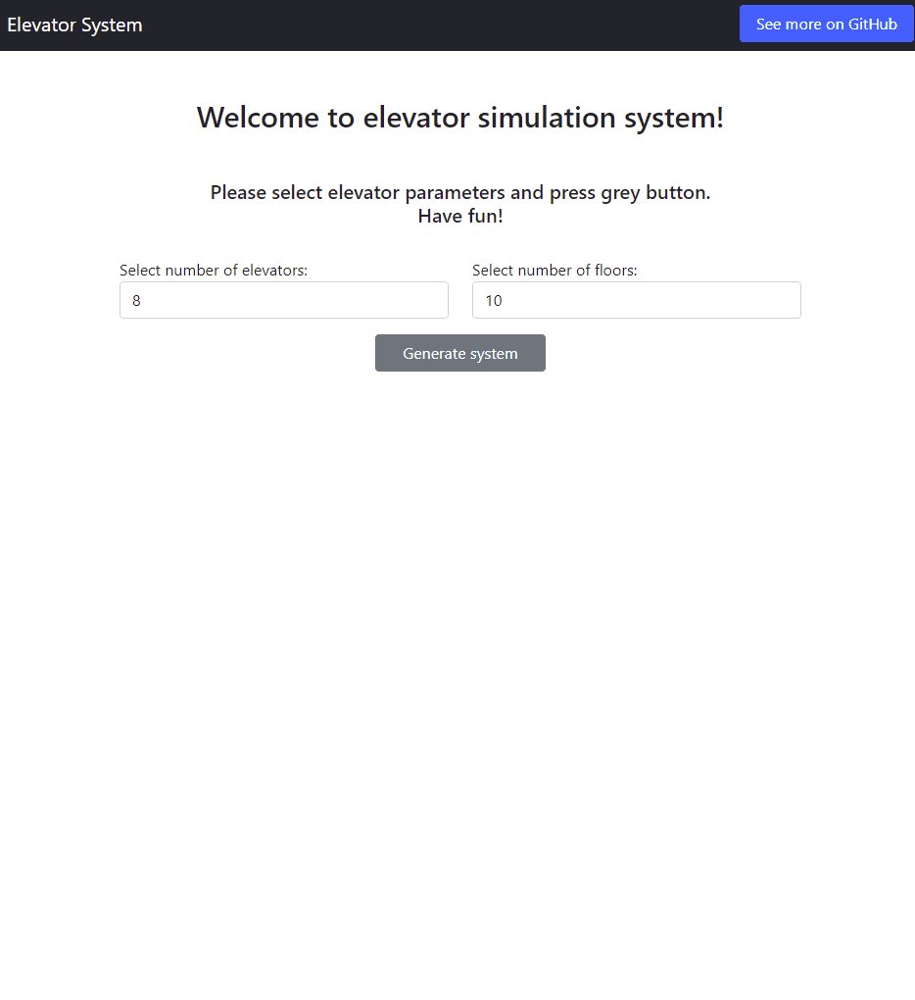

# Elevator System

## Description:

Simulation of multi-elevator control system in TypeScript.

## Screenshot: 

## Run instructions:

### From source:
In the main directory:

- `tsc elevatorSystem.ts --target es5`
- open `index.html` with any modern browser.

### Or see on [Github.io](https://def-au1t.github.io/elevator-logic/)

## How it works:

**Elevator system has the following main control operations:**

- `pushButtonInElevator(elevator, button)` - simulates physical button push inside the elevator. 
- `pickup(floor, direction)` - simulates physical button push on the floor. 
- `step()` - one time tick - elevator closes the door or moves one floor.

Each time system receives external request (with `pickup()`), it decides which elevator shoud receive it. Then, the request is bound forever to chosen elevator. The elevators are chosen in the following order:

- Elevator waiting without any job.
- Elevator currently becoming closer to request floor with the same direction as the request, with the least number of requests.
- Elevator currently becoming closer to request floor with opposite direction as the request, with the least number of requests.
- Elevator that moves in opposite direction and have the least number of requests.

**Each elevator tries to change direction as rarely as its possible and chooses next target in following order:**

- Nearest target (internal or bound external) in the direction it previously moves.
- Nearest target (internal or bound external) in opposite direction than it previously moves.
- Ground floor, if there are no other requests.

Such behavior prevents requests starvation. In the worst case, elevator needs to travel double of building height to response to request. 

While designing the algorithm, I focused on the simplicity and elevators load balancing. The main goal was handle all requests with finite time (here - max 2x building's height). Elevators in real live also have their capacity, and without load balancing it would be possible, that only one elevator would try to handle all requests causing overload. These are the reasons, why some requests could be finished a little faster that they are.

## Usage manual:

## Simulation video:

## Author:

Jacek Nitychoruk